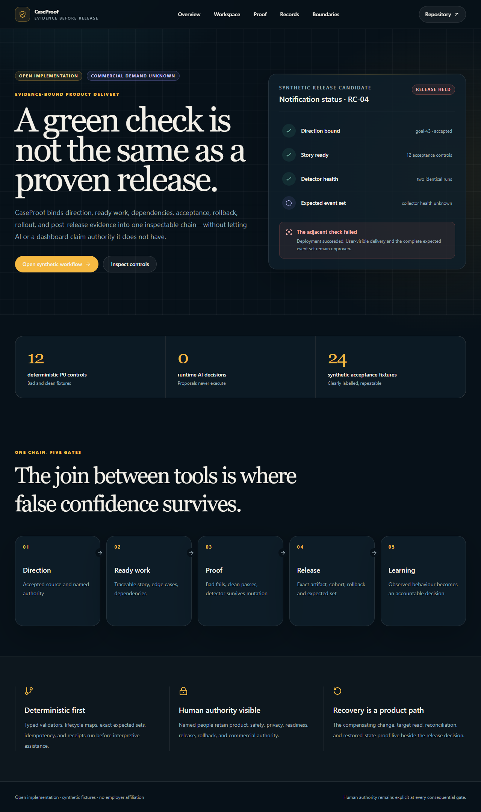

# CaseProof

CaseProof is an evidence-bound delivery control plane for safety-critical product work. It connects accepted direction to implementation-ready stories, dependency state, detector health, release evidence, rollback, rollout, and post-release reconciliation.

The repository is a real, runnable application work sample—not a deployed customer product and not a claim about an employer's internal systems.

> **Evidence boundary:** every included initiative, person identifier, event, receipt, and commercial record is synthetic. Buyer demand, production use, provider configuration, commercial viability, adoption, savings, and outcomes remain **UNKNOWN**. CaseProof is independent and is not affiliated with, commissioned by, or endorsed by SafelyYou.

## The problem

Roadmaps, tickets, tests, deployments, dashboards, support records, and decisions can each look current while disagreeing at their joins. A ticket marked complete does not prove the intended user behaviour. A deployment marked successful does not prove a safe release. A good rate over zero collected events does not prove success.

CaseProof makes those joins explicit and fails closed when the evidence required for a consequential transition is missing.

## Who it is for

- Product Owners translating accepted direction into ready, dependency-aware work
- Engineering and quality leads proving user-visible acceptance
- Safety, privacy, and release authorities retaining explicit decision rights
- Product leaders evaluating delivery reliability without mistaking activity for outcomes

These are target-user hypotheses, not evidence of current customers or demand.

## Implemented workflow

The initial vertical is deliberately narrow and complete:

1. Inspect one bounded synthetic notification-status initiative.
2. Trace its direction, vertical slice, story readiness, dependency, release, and reconciliation states.
3. Record a local human readiness review with React Hook Form and Zod validation.
4. Run 12 deterministic P0 controls over 12 known-bad and 12 clean synthetic fixtures.
5. Re-run the complete control suite and compare normalized receipt digests.
6. Disable the critical `DET-CP-R4` story-readiness detector and observe the release gate fail.
7. Restore the detector and observe the gate recover.
8. Inspect typed records, provenance, claim boundaries, and the source-only Supabase schema.

No step writes to a provider or external account.

## Screenshots

Desktop overview:



The real-browser journey also records the [disabled-detector state](docs/screenshots/workspace-mutation.png) and [390px mobile workflow](docs/screenshots/workspace-mobile.png). All displayed records are synthetic.

## Architecture

```text
Next.js 16 App Router UI
        |
        v
POST /api/v1/proof-runs  -- Zod request boundary
        |
        v
Deterministic control engine
  - 12 versioned detectors
  - 24 synthetic fixtures
  - stable SHA-256 receipts
  - disabled-detector mutation path
        |
        +--> local response only (current runnable mode)
        |
        +--> proposed Supabase evidence store (source schema, not applied)
             - 8 tables
             - RLS enabled on every table
             - tenant/role-scoped policies
             - append-only proof/evidence/audit records
```

Dependency direction is UI → typed API → deterministic domain engine → persistence boundary. The domain engine does not import UI or provider code.

Detailed decisions: [architecture](docs/architecture.md), [ADR-0001](docs/adr/0001-deterministic-evidence-spine.md), [schema](supabase/migrations/0001_caseproof_core.sql).

## Deterministic / AI / human split

| Layer | Owns | Current state |
|---|---|---|
| Deterministic software | Typed validation, lifecycle checks, exact expected sets, detector health, repeatability, evidence digests | **Implemented** |
| AI | May propose decomposition, edge-case questions, ambiguity prompts, or draft release language from accepted sources | **Proposed; no runtime AI call exists** |
| Named humans | Product meaning, safety, privacy, readiness, release, rollback, external communication, and commercial decisions | **Boundary implemented; real operating adoption UNKNOWN** |

## Controls

The suite implements blueprint requirements `CP-R1` through `CP-R12`: initiative authority, traceability, vertical slicing, story readiness, dependency control, restricted-data handling, bounded AI, detector health, release/rollback, rollout/enablement, reconciliation, and commercial handoff.

Each control records:

- detector and rule version;
- synthetic input digest;
- decision trace and issue code;
- unresolved unknowns;
- known-bad rejection and clean-fixture pass;
- first- and second-run receipt digests.

The mutation command intentionally exits non-zero when `DET-CP-R4` is disabled:

```powershell
npm.cmd run control:mutation
```

The restored gate exits zero:

```powershell
npm.cmd run control:gate
```

## Run locally

Requirements: Node.js 20.9+ and npm.

```powershell
git clone https://github.com/shrishmanglik/case-proof.git
cd case-proof
git switch dev/case-proof-initial-build
npm.cmd ci
npm.cmd run dev
```

Open `http://localhost:3000`, then:

1. Select **Open synthetic workflow**.
2. Submit the pre-filled human readiness review.
3. Select **Disable CP-R4** and confirm the suite becomes `UNHEALTHY` with 11/12 healthy controls.
4. Select **Run restored suite** and confirm 12/12 become `HEALTHY`.
5. Open **Proof** to inspect the repeated digests and mutation receipt.

## Quality commands

```powershell
npm.cmd test
npm.cmd run typecheck
npm.cmd run lint
npm.cmd run build
npm.cmd run control:gate
```

Exact results and fresh-clone evidence are recorded in [the evidence manifest](docs/evidence/manifest.md).

## UI and accessibility

- Semantic landmarks, headings, form labels, described validation errors, and live proof status
- Visible keyboard focus and a skip link
- Status text in addition to colour
- 44px minimum primary interactive targets
- Reduced-motion handling
- Responsive layouts designed for 390px without horizontal page overflow
- Explicit empty, loading, error, blocked, held, unknown, recovered, and populated states

## Security and privacy

- Synthetic fixtures only; no resident, health, video, employer, customer, or production data
- No secrets or credential reads
- No runtime AI calls and no external effects
- Typed API requests fail closed
- Proposed Supabase schema enables RLS on all eight application tables
- Tenant- and role-scoped policies; evidence, proof, and audit records are append-only for browser roles
- Provider application, auth operation, and live RLS behaviour remain **UNKNOWN** because no provider mutation was authorized

See [SECURITY.md](SECURITY.md), [evidence boundaries](docs/evidence-boundaries.md), and [recovery](docs/recovery.md).

## Commercial hypothesis

The proposed wedge is a bounded Delivery Reliability Diagnostic for teams whose roadmap intent, ticket state, release evidence, and user-visible behaviour disagree. Pricing, margins, buyer interest, demand, delivery cost, repeat use, and product-market fit are hypotheses from the governed blueprint—not public claims. No public price or viability claim is made by the application.

## Implemented versus proposed

| Capability | State |
|---|---|
| Responsive Next.js application and primary workflow | Implemented locally |
| Typed domain model and API boundary | Implemented locally |
| 12 deterministic controls / 24 synthetic fixtures | Implemented locally |
| Repeatability and critical mutation control | Implemented locally |
| Human readiness-review interaction | Implemented locally, session-only |
| Supabase schema and RLS policies | Source implemented; not applied |
| Authentication and durable multi-tenant persistence | Proposed |
| Roadmap, issue, release, analytics, and support adapters | Proposed, read-only first |
| AI proposal assistance | Proposed and intentionally non-executable |
| Production deployment or customer use | Not authorized / UNKNOWN |
| Commercial validation and outcomes | UNKNOWN |

## Roadmap

1. Independent review of this initial vertical.
2. Founder decision on whether the public work sample should merge; no deployment is implied.
3. If separately authorized, add local Supabase contract testing before any provider application.
4. Run qualified discovery and artifact-chain audits before treating the commercial wedge as demand.
5. Add read-only adapters only after tenant, privacy, authority, and recovery contracts are independently accepted.

## Repository status

- Public repository: `shrishmanglik/case-proof`
- Initial build branch: `dev/case-proof-initial-build`
- License: **UNKNOWN / not yet selected**. Public visibility does not grant reuse rights by itself.

Contributions and security reporting: [CONTRIBUTING.md](CONTRIBUTING.md), [SECURITY.md](SECURITY.md).
