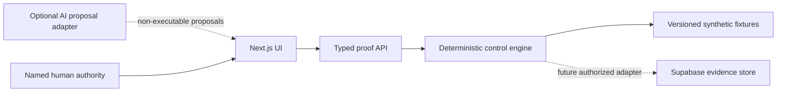

# Architecture

## Decision

CaseProof uses a deterministic evidence spine inside a Next.js 16 application. The runnable vertical is provider-independent: committed synthetic fixtures enter a typed API boundary, versioned detectors produce normalized receipts, and the UI exposes health, mutation, and authority state. A Supabase schema is included as the proposed durable boundary but is not applied or claimed live.

## Components

| Component | Responsibility | Evidence ceiling |
|---|---|---|
| App Router UI | Workflow, records, proof, boundaries, all interaction states | Local render only |
| `POST /api/v1/proof-runs` | Zod request validation and explicit disabled-detector mode | Local API only |
| Domain engine | 12 detectors, fixture execution, stable digests, health receipts | Committed fixtures only |
| Supabase migration | Tenant, role, initiative, story, dependency, proof, evidence, audit design | Source schema; provider state UNKNOWN |
| Human review form | Validates and records a session-local review signal | Not durable acceptance |

## Dependency direction

The engine has no UI, AI, provider, or environment dependency. SHA-256 receipts use canonical key ordering and exclude wall-clock time so identical inputs produce identical outputs.

## Failure semantics

- Malformed API input: `400 MALFORMED_REQUEST`; no run starts.
- Disabled detector: control state `UNHEALTHY`; release proof cannot advance.
- Client/API error: an explicit error state appears; prior evidence is preserved.
- Suspicious zero: `CP-R11` rejects unless the complete expected set and collector health reconcile.
- Provider absence: local synthetic mode continues; provider truth remains `UNKNOWN`.

## Persistence and RLS

The source migration defines eight application tables. Every table enables RLS. Policies use `auth.uid()` plus tenant membership and named roles. Proof runs, evidence receipts, and audit events are append-only to browser roles. Live policy behaviour is not claimed because the migration was not applied.

## Reversibility

The current vertical creates no external state. Rollback is deleting the local clone or reverting the branch commit. A future provider-backed implementation must ship forward and compensating migrations, dry-run receipts, target reads, and reconciliation before application.
